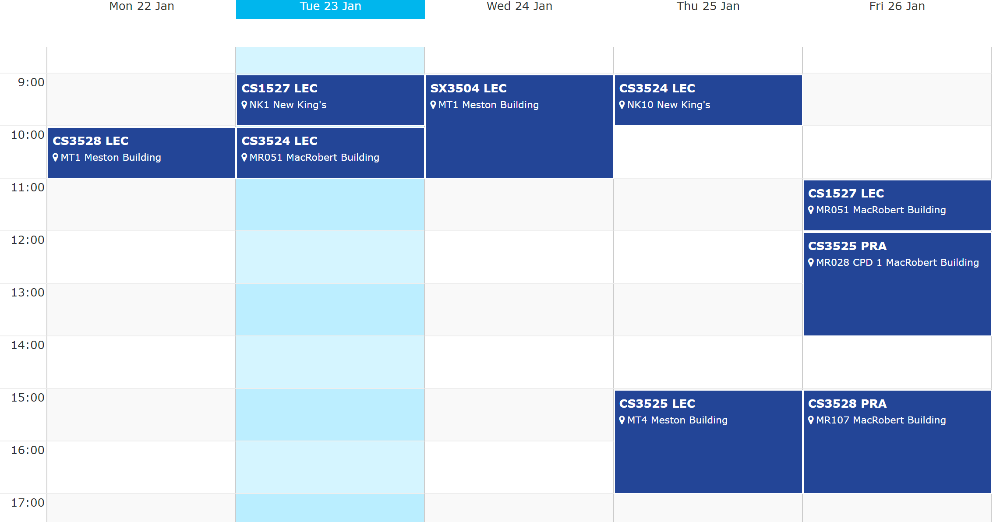
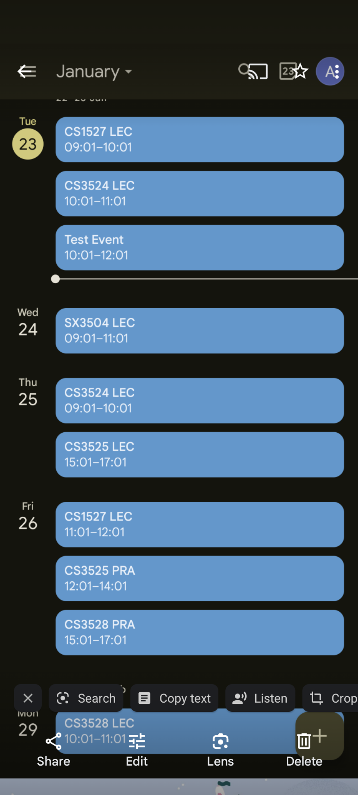
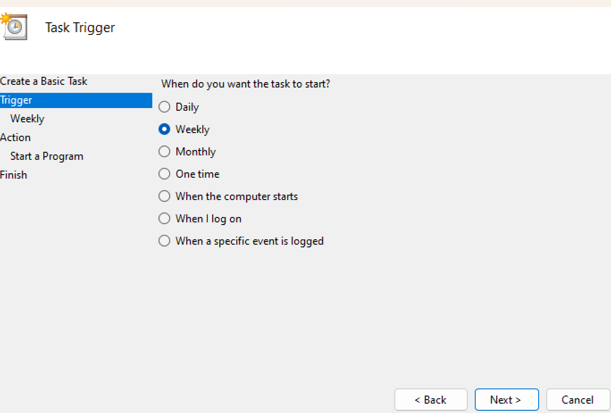
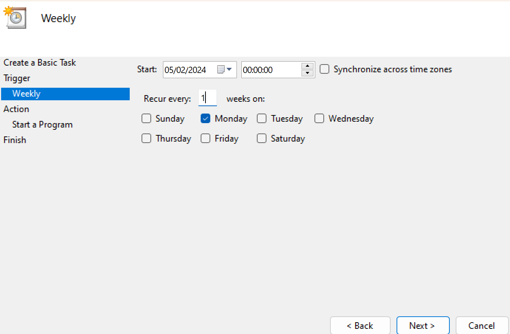
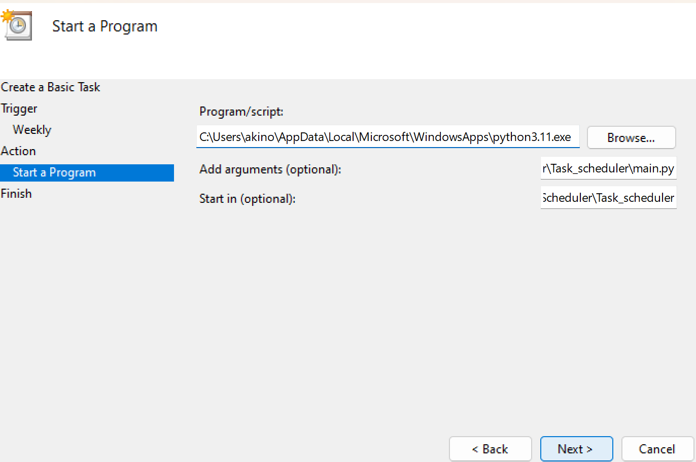

# Calendar Scheduler
This project is a calendar scheduler that webscrapes the details of class from univeristy timetable and inputs it into your google calendar

## Installation 
All necessary modules located in the requirments.txt

```bash
pip install -r requirements.txt
```

# My Project






# Additional Info
Due to .gitignore necessary files containing sensitive infornmation are ommitted from this final commit
So you will need to include the following file:
* .env -> Can be used to store university login details e.g. LOGOIN_USERNAME=u04ty34 LOGIN_PASSWORD=Spuderman777 (not my details so dont even try)
* a credentials.json file -> This is obtained when you create and verify a project with your gmail account in Google cloud console
* token.json -> This is generate when running the code in schedule_tasks.py

# Reasons for making this 
To practice webscraping and automated scheduling on windows :)
